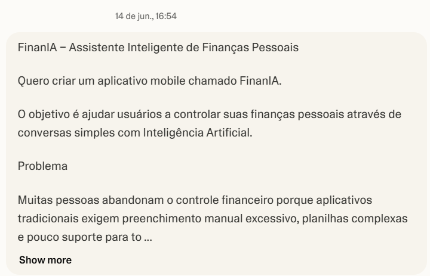
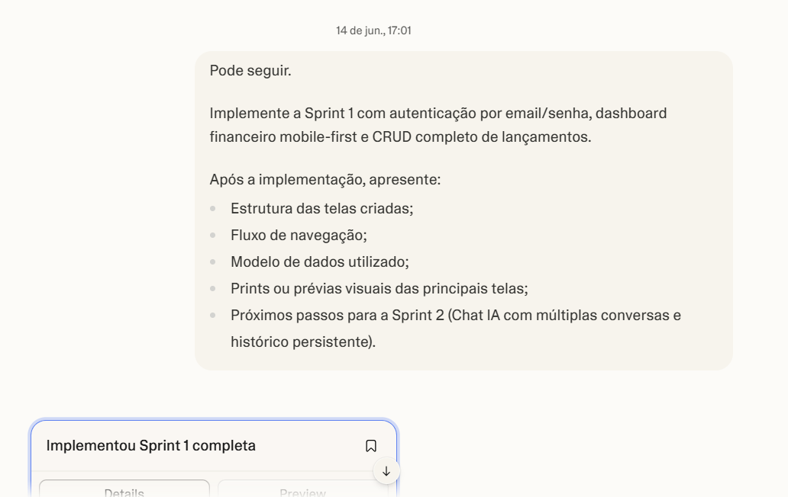
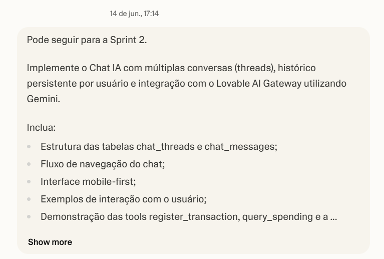
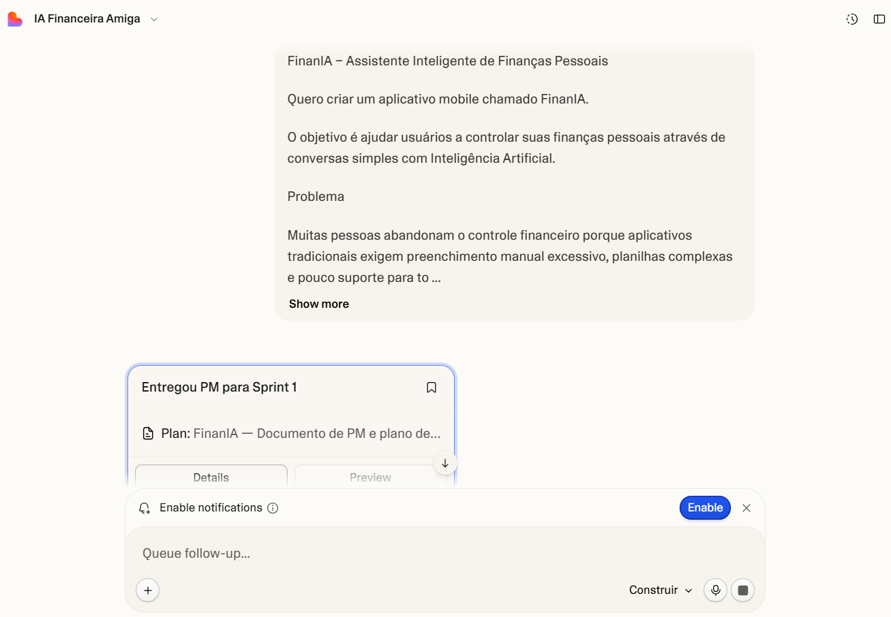
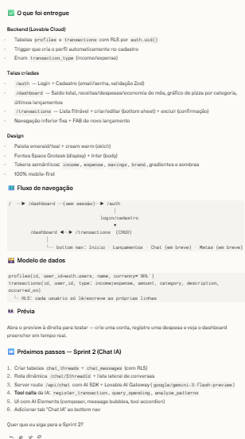
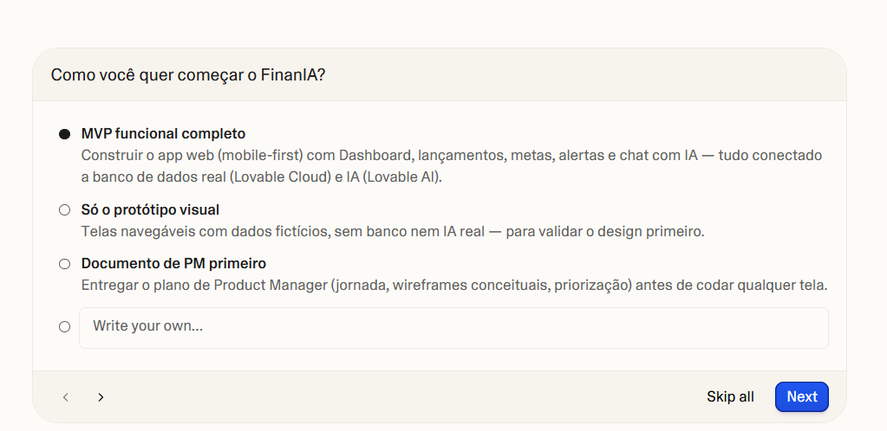
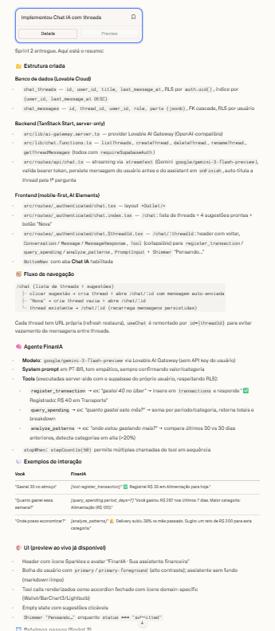
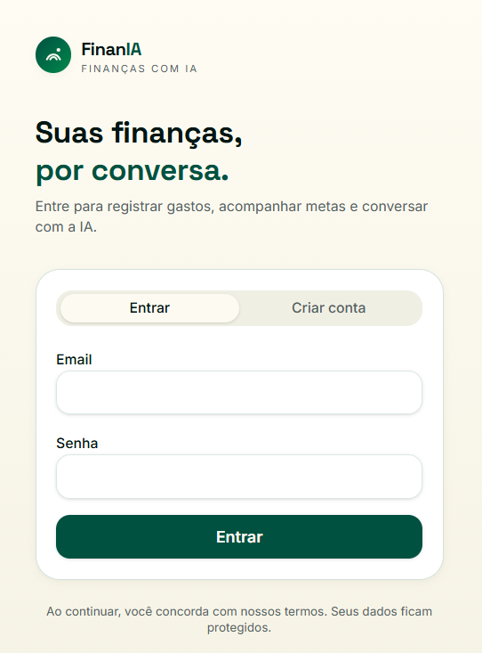

# 💸 FinanIA – Assistente Inteligente de Finanças Pessoais

Projeto desenvolvido durante o desafio **Vibe Coding da DIO**, utilizando Inteligência Artificial como parceira na concepção de um aplicativo de organização financeira pessoal.

O objetivo do FinanIA é permitir que usuários controlem suas finanças por meio de conversas naturais com uma IA, eliminando a necessidade de planilhas complexas e lançamentos manuais excessivos.

---

# 🎯 Problema

Muitas pessoas abandonam aplicativos financeiros porque:

- Exigem cadastro manual constante;
- Possuem interfaces complexas;
- Não oferecem orientação personalizada;
- Transformam o controle financeiro em uma tarefa cansativa.

O FinanIA busca resolver esse problema utilizando Inteligência Artificial conversacional para registrar gastos, analisar padrões financeiros e sugerir planos personalizados de economia.

---

# 👥 Público-Alvo

- Universitários
- Jovens profissionais
- Pessoas iniciando a organização financeira
- Famílias que desejam controlar gastos e atingir metas financeiras

---

# 🚀 Principais Funcionalidades

- Registro de receitas e despesas via conversa natural
- Dashboard financeiro inteligente
- Classificação automática de gastos
- Metas financeiras personalizadas
- Análise de padrões de consumo
- Sugestões de economia com IA
- Histórico de conversas persistente
- Alertas financeiros inteligentes

---

# 📋 PRD (Product Requirements Document)

## Contexto

Quero criar um aplicativo chamado **FinanIA** que funcione como um assistente financeiro pessoal baseado em Inteligência Artificial.

O usuário poderá registrar gastos, consultar seu histórico financeiro e receber recomendações personalizadas por meio de conversas naturais, tornando o controle financeiro simples e acessível.

## Problema

Muitas pessoas desistem de controlar suas finanças porque os aplicativos atuais exigem muita entrada manual de dados e oferecem pouca personalização.

## Público-Alvo

Pessoas que desejam organizar melhor suas finanças sem depender de planilhas ou processos complexos.

## Funcionalidades-Chave

1. Registrar gastos via chat.
2. Categorizar automaticamente transações.
3. Criar e acompanhar metas financeiras.
4. Receber sugestões personalizadas de economia.
5. Visualizar relatórios e indicadores financeiros.

## Entregável Esperado

- Plano de MVP
- Fluxo de telas
- Definição do agente de IA
- Jornada do usuário
- Estratégia de validação do produto

---

# 🏗️ Documento de Product Manager

A partir do PRD, foi gerado um documento completo contendo:

- Visão do Produto
- Personas
- Roadmap
- Jornada do Usuário
- Wireframes Conceituais
- Fluxo de Navegação
- Arquitetura Técnica
- Modelo de Dados
- Estratégia de Validação
- Roadmap de Sprints

---

# 🚀 Evolução do Projeto

## Sprint 1 – Fundação do MVP

Implementação das funcionalidades básicas:

- Login e cadastro de usuários
- Dashboard financeiro
- CRUD de lançamentos financeiros
- Banco de dados seguro com RLS
- Navegação mobile-first

### Tecnologias

- React
- TanStack Start
- Tailwind CSS
- Lovable Cloud
- PostgreSQL

---

## Sprint 2 – Inteligência Artificial

Implementação do agente conversacional FinanIA:

### Funcionalidades

- Chat IA com múltiplas conversas
- Histórico persistente
- Integração com Gemini
- Registro automático de gastos
- Consulta de despesas
- Análise de padrões financeiros
- Sugestões inteligentes de economia

### Ferramentas da IA

#### register_transaction

Registra despesas e receitas a partir de linguagem natural.

Exemplo:

> "Gastei R$ 40 no Uber"

#### query_spending

Consulta gastos por período ou categoria.

Exemplo:

> "Quanto gastei este mês?"

#### analyze_patterns

Analisa tendências financeiras.

Exemplo:

> "Onde estou gastando mais?"

---

# 📸 Evidências do Desenvolvimento

## Prompt Inicial

---

## Refinamento do Prompt

---

## Prompt Final

---

## Documento de Product Manager

---

## Resumo da Sprint 1

---

## Resultado da Sprint 1

---

## Implementação da Sprint 2

---

## FinanIA

---

# 🧠 O que Aprendi

Durante este desafio percebi que desenvolver com IA vai muito além da programação tradicional.

O principal aprendizado foi a importância de criar prompts claros, fornecer contexto adequado e evoluir gradualmente os requisitos do produto.

Também compreendi como ferramentas de IA podem atuar como parceiras no processo de desenvolvimento, auxiliando na criação de:

- Produtos digitais
- Fluxos de navegação
- Modelagem de dados
- Experiência do usuário
- Estratégias de validação

---

# 💡 Reflexão Final

O desafio mostrou que o Vibe Coding não é apenas pedir para a IA criar algo.

É um processo de construção colaborativa onde o profissional define objetivos, fornece contexto, valida resultados e evolui a solução junto com a Inteligência Artificial.

Essa experiência reforçou competências importantes para minha transição para a área de tecnologia e análise de dados, especialmente em produtos apoiados por IA.

---

# 🔗 Tecnologias e Ferramentas Utilizadas

- GitHub
- GitHub Copilot
- Lovable
- Gemini
- Lovable AI Gateway
- React
- TanStack Start
- PostgreSQL
- Tailwind CSS

---

## 👩‍💻 Autora

**Thaísa Encarnação**

Doutora em Neurociências e estudante de Análise de Dados para Políticas Públicas.

Projeto desenvolvido para o desafio **DIO – Vibe Coding: App de Finanças Pessoais com IA**.
